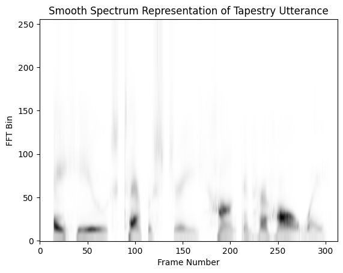

# Python Auditory Toolbox

This is a Python port of (portions of) the 
[Matlab Auditory Toolbox](https://engineering.purdue.edu/~malcolm/interval/1998-010/).

The Python Auditory toolbox includes these functions from the original in Matlab:
- Patternson-Holdworth ERB (Gammatone) Filter Bank
  - MakeErbFilters
  - ErbFilterBank
- Correlogram Processing
  - CorrelogramFrame
  - CorrelogramArray
  - CorrelogramPitch
- Demonstrations
  - MakeVowel
  - FMPoints 

This toolbox does not include Lyon's Passive Long-wave Cochlear model as this model
has been supersceded by [CARFAC](https://github.com/google/carfac).

## Examples
Here are the frequency responses for a 10-channel ERB gammatone filtebank.
)

Here is an example of a correlogram, here with a number of harmonic examples 
that demonstrate the correlogram representation.
<video src="examples/DudaVowelsCorrelogram.mp4" controls title="Correlogram Example"></video>

MFCC (mel-frequency cepstral coefficients) is a classic speech representation
that was often used in (pre-DNN) speech recognizers.  It converts the original spectrogram, shown here, 

into a 40 channel filterbank.  And finally into a 13-dimensional cepstral representation.  

We can invert these steps to reconstruct the original filterbank representation

And then the reconstruct the original spectrogram.

Note, in particular, the pitch harmonics (the horizontal banding) have been filtered out by the cepstral processing.